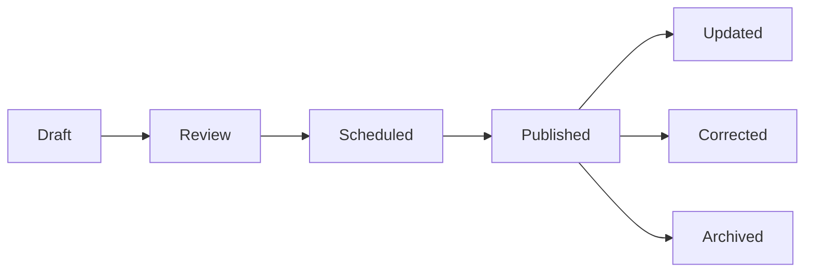

# WordPress News Portal — Product Requirements Document (PRD)

> **Document Classification:** Confidential working PRD • WordPress-first • v1.0  
> **Goal:** A scalable, editor-friendly news website designed for direct WordPress integration.

---

> [!NOTE]
> **Product Intent**  
> Make daily publishing fast, predictable, and low-risk: editors should be able to publish articles, images, videos, and monetization placements without developers touching individual stories.

| Document Attribute | Value |
| :--- | :--- |
| **Version** | 1.0 |
| **Status** | Build-ready product requirements |
| **Primary CMS** | WordPress |
| **Primary Content Types** | News articles, videos, galleries, live updates, pages |
| **Audience** | Readers, editors, reporters, ad/monetization team, site administrators |
| **Design Principle** | News-first, fast, modular, reusable, mobile-first |

---

## 1. Executive Summary

This PRD defines a WordPress-first news portal that can support high-frequency daily publishing, multimedia content, advertising, SEO, social distribution, and future scale without requiring custom development for routine newsroom work. The website should behave like a publishing product, not a static brochure site.

> [!IMPORTANT]
> **Non-negotiable**  
> Do not build page designs that depend on hardcoded content or manually positioned text/images. Every major homepage and article element must map to editable WordPress data, Gutenberg blocks, templates, widgets, or structured fields.

---

## 2. Product Goals

- **Rapid Publishing:** Publish breaking and daily news in minutes, with minimal repetitive formatting.
- **Recognizable Visual Hierarchy:** Create a strong, recognizable visual hierarchy across homepage, category, article, video, and special pages.
- **Independent Editability:** Make content, media, and ad slots independently editable from WordPress.
- **Protect Organic & Search Traffic:** Protect search traffic through clean information architecture, metadata, schema, canonical URLs, sitemaps, and redirect handling.
- **High Performance:** Keep page speed and Core Web Vitals strong despite ads, images, embeds, and video.
- **Robust Newsroom Workflow:** Provide a newsroom workflow with drafts, review, scheduled publishing, revisions, corrections, and role-based permissions.
- **Sustainable Monetization:** Support monetization without rebuilding the site each time an ad format or sponsor changes.
- **Clean Architecture & Maintainability:** Theme and plugins should separate presentation, content, and business logic so upgrades do not destroy content.

---

## 3. Success Metrics

| Area | KPI / Target | Measurement |
| :--- | :--- | :--- |
| **Publishing** | Typical article live in <5 minutes after final copy is ready | Editorial workflow timestamps |
| **Performance** | Mobile LCP target $\le 2.5\text{s}$ on key templates; minimize CLS | PageSpeed / CrUX / RUM |
| **Engagement** | Increase pages/session and article completion | GA4 / analytics |
| **SEO** | Indexed pages discoverable with valid canonical + schema | Search Console + rich result validation |
| **Monetization** | High fill rate without harmful layout shift | Ad server / analytics |
| **Reliability** | No critical broken templates or media failures after releases | QA + uptime monitoring |
| **Editorial quality** | 100% of publishable stories have required metadata and media | CMS validation checklist |

---

## 4. Target Users & Roles

| Role | Needs | Key Permissions |
| :--- | :--- | :--- |
| **Reader** | Fast access to trustworthy news, categories, video, and search | Read, share, search, save if enabled |
| **Reporter / Author** | Create and save stories quickly | Draft, edit own content, upload media, submit review |
| **Copy Editor** | Review language, headline, metadata, and structure | Edit drafts, approve/reject, schedule if granted |
| **Editor** | Control homepage, breaking news, featured content, and corrections | Publish, schedule, feature, pin, edit any assigned story |
| **Ad / Monetization Manager** | Manage placements and campaigns without editing article templates | Manage ad zones, sponsors, campaigns, reports |
| **SEO Manager** | Control metadata, schema, redirects, indexing, and canonicals | Edit SEO fields, redirects, taxonomy SEO settings |
| **Administrator** | Site configuration, plugins, users, backups, security | Full access |

---

## 5. Information Architecture

The URL and navigation structure should be simple enough for users to understand and stable enough for search engines to maintain authority.

| Primary Area | Example URL Pattern | Required Features |
| :--- | :--- | :--- |
| **Home** | `/` | Lead story, latest, sections, video, trending, newsletter, ads |
| **Category** | `/category/business/` or `/business/` | Section hero, latest, pagination/infinite load, SEO text |
| **Sub-category** | `/business/markets/` | Focused stream, breadcrumbs, filters where relevant |
| **Article** | `/business/markets/example-story/` | Headline, author, time, hero image, body, related, ads, video |
| **Video** | `/videos/example-video/` | Video player, poster, transcript/description, related video |
| **Search** | `/search/?q=...` | Search, filters, empty states |
| **Author** | `/author/name/` | Bio, author articles, social profile |
| **Tag / Topic** | `/tag/topic/` | Topic stream, SEO controls |
| **Special / Live** | `/live/example/` | Timeline updates, timestamps, pinned updates |
| **Static Pages** | `/about/`, `/contact/`, `/privacy/`, `/advertise/` | Standard content templates |

---

## 6. Core Content Model (WordPress)

Use WordPress native Posts where practical, with custom post types only where the workflow or data model genuinely differs. Avoid multiplying post types for cosmetic reasons.

| Content Object | Recommended Implementation | Important Fields |
| :--- | :--- | :--- |
| **News Article** | WP Post + structured custom fields | Headline, dek, author, section, tags, status, publish/update time, hero media, caption, source, excerpt, body, SEO, social image, sponsored label, correction note |
| **Video** | Video CPT or Post format depending on workflow | Video URL/provider, poster, duration, caption, transcript, source, embed/privacy settings, related stories |
| **Photo Gallery** | Gallery CPT or Post + gallery block | Gallery title, images, captions, credits, ordering, alt text |
| **Live Blog** | Dedicated CPT / plugin-backed structure | Event status, updates, timestamps, pinned update, contributors |
| **Author** | WP user profile + author metadata | Name, role, bio, photo, social links, display settings |
| **Topic / Section** | WP taxonomy | Name, slug, description, SEO title/meta, hero image, ordering |
| **Advertisement** | Ad-management plugin / ad server integration | Zone ID, format, device, campaign, start/end, targeting, fallback |
| **Site Settings** | Custom settings page / theme options | Logo, colors, typography, header, footer, social, analytics IDs, defaults |

---

## 7. Design System & UI Requirements

- **Responsive Breakpoints:** Mobile-first responsive layout with deliberate breakpoints for mobile, tablet, and desktop.
- **Design Tokens & Systems:** Use a consistent grid, spacing scale, typography scale, and component library across templates.
- **Typography Hierarchy:** Headline typography must clearly separate breaking news, section headlines, cards, and body copy.
- **Article Card Variants:** Every article card component needs variants: *standard*, *horizontal*, *featured*, *compact*, *video*, and *sponsored*.
- **Modular Components:** All recurring modules must be reusable blocks/components rather than one-off page layouts.
- **Accessibility (a11y):** Semantic headings, keyboard navigation, focus states, color contrast, alt text, captions/transcripts where applicable, and reduced-motion handling.
- **Aspect Ratio Handling:** Images must support multiple aspect ratios without awkward cropping. Preserve a focal point where WordPress supports it.
- **Ad Visual Separation:** Keep ad areas visually distinct but not visually dominant enough to destroy reading flow.

---

## 8. Homepage Requirements

| Module | Requirement | CMS Control |
| :--- | :--- | :--- |
| **Header** | Logo, primary nav, search, menu, optional live/breaking indicator | Theme settings + menu |
| **Breaking Strip** | Optional scrolling/listed breaking updates | Editor can enable/disable and reorder |
| **Lead Package** | 1 main story + supporting stories or a configurable lead grid | Featured/pinned flag or homepage builder |
| **Latest News** | Chronological feed with time and section | Auto-populated from posts |
| **Section Modules** | Business, politics, tech, sports, etc. | Select category + count + layout variant |
| **Video Block** | Latest/featured video with poster image | Video CPT / provider |
| **Trending** | Manual or analytics-driven list | Configurable logic |
| **Newsletter** | Signup block with consent text | ESP integration / embed |
| **Ad Zones** | Top, in-content home, sidebar, sticky/mobile as appropriate | Ad manager / zone IDs |
| **Footer** | Navigation, legal, social, newsletter, and contact | Theme settings |

---

## 9. Article Page Requirements

- **Article Header:** Section label, headline, optional dek, author, published time, updated time, reading time if used.
- **Hero Media:** Hero image/video with caption and photographer/source credit.
- **Body Content Support:** Article body must support paragraphs, subheads, images, galleries, quotes, lists, embeds, tables, pull quotes, and related-story cards.
- **Editorial Corrections:** Visible update/correction disclosure when a story is materially changed.
- **Key Points:** Optional "What you need to know" or key-points module for important stories.
- **Sharing:** Share controls that work seamlessly on mobile and desktop.
- **Related Stories:** Related stories based on topic/category/manual selection; do not rely entirely on a random algorithm.
- **Continuous Reading:** Next/previous or continuous story navigation should not create duplicate/invalid analytics pageviews.
- **Dynamic Ad Placements:** Configurable in-content ad insertion points without hardcoding ads into editorial copy.
- **Auxiliary Modules:** Author box, source notes, corrections, newsletter CTA, and footer recommendation modules.
- **Comments Management:** Comments should be optional; do not enable them by default without moderation, spam controls, and a clear abuse workflow.

---

## 10. Video Publishing & Media System

> [!WARNING]
> **Important Architecture Choice**  
> Do not make WordPress the video transcoding platform unless the traffic profile and infrastructure explicitly justify it. For scale, use a dedicated video host/CDN or provider, while WordPress stores the metadata and embed/reference. This reduces storage, CPU, and delivery pressure on the WordPress server.

| Requirement | Specification |
| :--- | :--- |
| **Upload Flow** | Editor selects/uploads video or pastes provider URL; system generates/accepts poster, title, caption, and duration |
| **Player** | Responsive player, poster-first loading, captions, controls, privacy-conscious embeds |
| **Performance** | Lazy-load video players/iframes until needed; do not load heavy player assets on pages without video |
| **Article Integration** | Video can be lead media, inline block, related video, homepage card, or dedicated video page |
| **SEO** | Video title, description, thumbnail, duration, and structured data where eligible |
| **Accessibility** | Captions for important editorial video; transcript support for high-value content |
| **Rights & Attribution** | Source/credit field, usage rights note, takedown workflow where needed |
| **Failure State** | If provider is unavailable, show poster + fallback message; do not leave broken blank frames |

---

## 11. Advertising & Monetization System

Ads should be implemented as reusable, named slots. Editorial templates must never contain hardcoded advertiser-specific HTML. The same slot should be replaceable without changing the article template.

| Ad Slot | Desktop | Mobile | Notes |
| :--- | :--- | :--- | :--- |
| **Header / Top** | Leaderboard / responsive | Responsive banner | Avoid layout shift with reserved dimensions |
| **Homepage Lead** | Responsive display | Responsive display | Keep below lead content when needed |
| **Article Top** | Responsive display | Responsive display | Do not push headline excessively below fold |
| **In-article 1** | Responsive | Responsive | After defined content depth |
| **In-article 2+** | Optional | Optional | Frequency controlled; avoid overloading short stories |
| **Sidebar** | 300x250 / responsive | Usually hidden or repositioned | Sticky only where acceptable |
| **Sticky Bottom / Mobile** | Optional | Responsive sticky | Clear close control; frequency cap |
| **Sponsored Content** | Native labeled module | Native labeled module | Must be visibly labeled sponsored/advertisement |
| **Video Ad** | Provider/ad-server based | Provider/ad-server based | Follow player/ad policy and performance rules |

### Required Ad Controls
- Per-slot enable/disable
- Device targeting & page targeting
- Campaign start/end dates & priority
- Fallback creative configuration
- Test mode & frequency caps (where supported)
- Reporting IDs
- Clear distinction between editorial content and sponsored content

---

## 12. Editorial Workflow

| Stage | Action | Validation |
| :--- | :--- | :--- |
| **Draft** | Author creates story | Required headline, section, and slug; autosave/revision enabled |
| **Review** | Editor checks accuracy, headline, media, SEO | Preview on desktop/mobile; checklist |
| **Scheduled** | Set publication date/time | Timezone verified; scheduled status visible |
| **Published** | Story goes live | Cache purge; sitemap/RSS/social integrations; analytics event |
| **Updated** | Material change recorded | Updated timestamp; correction note when applicable |
| **Corrected** | Correction workflow | Correction reason/text preserved in article history |
| **Archived** | Old / obsolete content handled | Redirect/canonical/index policy defined per content type |

---

## 13. SEO & Discoverability

- **Metadata:** Unique title, meta description, canonical URL, and social metadata for every indexable article.
- **XML Sitemaps:** XML sitemap coverage for posts, pages, authors, and relevant taxonomies; exclude thin, duplicate, and administrative URLs.
- **Structured Data:** News-specific structured data where valid, including `Article`/`NewsArticle` schema and relevant author/publisher information.
- **Breadcrumbs:** Breadcrumbs with semantic markup and human-readable navigation.
- **Social Sharing:** Open Graph / X sharing image and title controls; fallback images configured at site level.
- **Permalinks & Slugs:** Clean permalinks and a controlled slug strategy. Do not casually change URLs after indexing.
- **301 Redirects:** 301 redirect manager for old URLs and migration work. Never rely on ad-hoc server edits for routine editorial changes.
- **Pagination & Archives:** Pagination and canonicalization strategy documented for category/tag/archive pages.
- **Internal Linking:** Related stories, topic links, author links, and section navigation.
- **Robots & Indexing Control:** `robots.txt` and noindex rules must be explicit. Prevent indexing of internal search, thin utility pages, and accidental staging content.
- **Feeds:** RSS feeds should remain available unless a clear business reason exists to disable them.

---

## 14. Performance & Core Web Vitals

| Area | Requirement |
| :--- | :--- |
| **Images** | Use WebP/AVIF where supported, responsive `srcset`, `width`/`height` attributes, lazy-load below fold, eager-load only primary hero when justified |
| **CSS/JS** | Minimize render-blocking assets; load component scripts only where used |
| **Fonts** | Limit font families/weights; self-host or use a performance-conscious strategy; avoid late layout shifts |
| **Caching** | Page cache + object cache where appropriate; CDN for static assets |
| **Ads** | Reserve dimensions, lazy-load below-fold placements, minimize synchronous third-party scripts |
| **Video** | Poster first; lazy player initialization; avoid auto-loading heavy embeds |
| **Database** | Control revisions, orphaned media, transients, and plugin bloat; monitor query performance |
| **Monitoring** | Real-user metrics (RUM) plus synthetic checks on homepage, category, article, and video templates |

---

## 15. WordPress Integration Architecture

The design system and implementation should map cleanly to WordPress so a developer can build once and editors can operate the site without code changes.

| Layer | Recommended Approach | Do Not Do |
| :--- | :--- | :--- |
| **Theme** | Custom block-friendly theme or carefully selected lightweight base | Do not bury business logic inside a theme that cannot be reused |
| **Blocks** | Gutenberg core blocks + custom reusable blocks for news modules | Do not create a new custom block for every article variation |
| **Fields** | ACF/custom fields only where structured data is needed | Do not store structured content in uncontrolled shortcodes |
| **Templates** | Block templates / template parts for Home, Archive, Single, Video, Author, Search, 404 | Do not manually build each page in a visual builder |
| **Menus** | WP Navigation / Menu system | Do not hardcode nav labels/links |
| **Media** | WP Media Library for images; dedicated video provider for scale where appropriate | Do not upload large uncompressed videos directly to shared hosting |
| **Ads** | Named ad zones and an ad-management layer | Do not hardcode ad vendor snippets inside article HTML |
| **SEO** | Established SEO plugin or custom controlled fields + schema layer | Do not install multiple SEO plugins fighting over metadata |
| **Analytics** | Single measurement plan with GA4/GTM or selected stack | Do not fire duplicate pageview/event tags |
| **Caching / CDN** | Host/CDN strategy defined before launch | Do not add random performance plugins without compatibility testing |

---

## 16. Page & Template Inventory

| Template | Priority | Key Modules |
| :--- | :--- | :--- |
| **Homepage** | P0 | Header, breaking, lead, latest, sections, video, trending, newsletter, ads, footer |
| **Standard Article** | P0 | Article header, hero, body, media, ads, related, author, newsletter, footer |
| **Category / Section** | P0 | Section hero, latest feed, featured, pagination, SEO content, ads |
| **Search Results** | P0 | Search box, filters, results, no-results state, pagination |
| **Video Detail** | P0 | Player, metadata, related stories/videos, ads, transcript |
| **Author** | P1 | Bio, social, article feed, pagination |
| **Tag / Topic** | P1 | Topic header, article feed, SEO fields |
| **Live Blog** | P1 | Status, timeline, pinned update, update composer |
| **Photo Gallery** | P1 | Gallery grid, detail/lightbox, captions, credits |
| **Static Content** | P0 | About, contact, advertise, privacy, terms, editorial policy, corrections |
| **404** | P0 | Search, popular stories, primary categories, helpful navigation |

---

## 17. Search, Discovery & Reader Features

- **Search Capabilities:** Fast site search with title/body/tag/topic matching; typo tolerance may be added in Phase 2.
- **Search Filters:** Filters for date, section, content type, and author if search volume justifies it.
- **Trending & Most Read:** Trending and most-read modules must have a defined calculation window and editorial override.
- **Related Content:** Related content should use taxonomy plus manual editorial curation for high-priority stories.
- **Continuous Reading:** Optional "read next" / continuous reading should preserve canonical URLs and analytics accuracy.
- **User Subscriptions:** Optional newsletter and push notification signup must include explicit consent and preference handling.

---

## 18. Security, Privacy & Governance

- **Access Controls:** Use least-privilege WordPress roles and separate admin/editor accounts.
- **Authentication:** Enable MFA for administrators and protect login endpoints appropriately.
- **Updates & Staging:** Keep WordPress core, theme, and plugins updated; maintain staging before production updates.
- **Backup & Disaster Recovery:** Automated daily backups plus off-site retention; test restores, not just backup creation.
- **Edge Security:** Use WAF/CDN protection where appropriate and monitor suspicious login/API activity.
- **Plugin Governance:** Limit plugin count. Every plugin must have a business owner and documented purpose.
- **Compliance:** Privacy pages, cookie/consent handling, and third-party tracking disclosures must be reviewed for the target jurisdiction.
- **Auditability:** Editorial corrections should be traceable. Never silently overwrite material changes when transparency matters.
- **Rights Management:** Media and article rights/credits need a documented ownership and takedown process.

---

## 19. Analytics & Reporting

| Dashboard | Required Metrics |
| :--- | :--- |
| **Editorial** | Published articles/day, publishing time, top stories, update frequency, author output |
| **Audience** | Users, sessions, engaged sessions, article views, scroll/completion proxy, returning users |
| **Content** | Top sections, top authors, video plays/completion, search terms, related-content clicks |
| **Monetization** | Impressions, viewability, fill, CTR, revenue by placement/campaign where available |
| **Technical** | LCP, INP, CLS, errors, uptime, cache hit ratio, image failure rate |
| **SEO** | Indexed pages, impressions, clicks, CTR, top queries, coverage issues, rich results |

---

## 20. Admin & Editorial UX Requirements

- **Clean Creation Flow:** Create article flow should expose only fields relevant to publishing; avoid a giant form full of unused options.
- **Sensible Defaults:** Use sensible defaults for section, author, social image, SEO, related content, and ad behavior.
- **True Previews:** Preview must show the real article template, not a generic WordPress preview.
- **Bulk Operations:** Bulk actions should support category/tag changes, scheduled content review, and media housekeeping.
- **Editorial Controls:** Editors should have a clear homepage featuring workflow and a separate site-admin area for technical settings.
- **Curation Without Code:** Homepage curation should support pin/unpin/reorder without editing code.
- **Media Management:** Media library needs search/filter by date, type, author/credit, and usage where feasible.

---

## 21. "Often Missed" Requirements — Add These Before Build

> [!CAUTION]
> **High-Risk Omissions**  
> These are the details that commonly cause expensive rework after a news site launches.

| Requirement | Why It Matters |
| :--- | :--- |
| **Article correction history** | Need explicit correction/update behavior and visible disclosure rules. |
| **Slug and redirect management** | Changing headlines cannot casually break indexed URLs. |
| **Homepage editorial controls** | Editors need a way to feature, pin, reorder, and remove stories without developers. |
| **Image focal points and credits** | Cropping and attribution problems become daily operational issues. |
| **Ad slot abstraction** | Ads need to change without touching templates or article HTML. |
| **Reserved ad/image dimensions** | Prevents cumulative layout shift (CLS) and poor Core Web Vitals. |
| **Scheduled publishing + timezone** | Critical for early-morning or embargoed news. |
| **Staging environment** | Plugin/theme changes must be tested before production. |
| **Backup restore testing** | A backup that cannot restore is not a backup strategy. |
| **Search empty/error states** | Users need helpful results, not dead ends. |
| **Broken media fallback** | Provider/API failures should degrade gracefully. |
| **Schema + social preview** | A story can be "published" yet still look broken in search/social. |
| **Newsletter consent** | Do not bolt subscriptions on later without a data/privacy model. |
| **404 and old-content handling** | News sites accumulate dead URLs quickly. |
| **Plugin governance** | Plugin sprawl becomes a performance, security, and maintenance problem. |
| **Analytics event taxonomy** | Define event names before implementation to avoid unusable reporting. |
| **Editorial source/rights metadata** | Required if the portal republishes third-party images, video, or wire content. |
| **Accessibility** | Captions, alt text, and keyboard behavior are product requirements, not post-launch polish. |
| **Mobile sticky UI** | Sticky headers/sticky ads can consume too much viewport; define behavior explicitly. |
| **Emergency breaking-news mode** | Provide a way to surface a major story immediately without redesigning the entire homepage. |

---

## 22. Content Entry Specifications

| Field | Required? | Rule |
| :--- | :--- | :--- |
| **Headline** | Yes | Clear, editable, no HTML dependence |
| **Slug** | Yes | Editable before/after publish with redirect support |
| **Section** | Yes | Single primary section |
| **Tags / Topics** | Recommended | Controlled taxonomy; avoid tag explosion |
| **Author** | Yes | Linked to WordPress author profile |
| **Publish date/time** | Yes | Timezone explicit |
| **Updated date/time** | System | Displayed when materially updated |
| **Excerpt / Dek** | Recommended | Used in cards/social/search where configured |
| **Hero media** | Usually yes | Required for homepage-quality stories unless text-only format allowed |
| **Caption / Credit** | When applicable | Preserve source/rights information |
| **Body** | Yes | Block-based editorial content |
| **SEO title/meta** | Recommended | Fallback to title/excerpt when blank |
| **Social image** | Recommended | Fallback to hero/site default |
| **Sponsored flag** | Conditional | Required for sponsored/native content |
| **Correction note** | Conditional | Visible when used |

---

## 23. Non-Functional Requirements

| Category | Requirement |
| :--- | :--- |
| **Availability** | Production target $\ge 99.9\%$ monthly availability excluding planned maintenance |
| **Scalability** | Architecture must handle traffic spikes from breaking news without redesigning templates |
| **Security** | MFA, least privilege, secure updates, backup/restore, WAF/CDN as appropriate |
| **Performance** | Key templates meet agreed Core Web Vitals targets under realistic mobile conditions |
| **Accessibility** | Target WCAG 2.2 AA practices for core user journeys |
| **Maintainability** | Reusable templates/components; documented plugin ownership and update policy |
| **Compatibility** | Latest stable Chrome/Edge/Firefox/Safari plus current mobile browser versions |
| **Observability** | Server and frontend errors logged; uptime and performance monitored |
| **Disaster Recovery** | Defined RPO/RTO appropriate to the publication; restoration procedure tested |

---

## 24. QA & Acceptance Criteria

- [ ] An editor can create, preview, schedule, publish, update, and correct an article without code.
- [ ] Homepage modules populate correctly from WordPress data and do not break when fewer stories are available.
- [ ] All required templates render correctly on mobile, tablet, and desktop.
- [ ] Images display at appropriate responsive sizes and do not cause obvious layout shift.
- [ ] Ads can be enabled/disabled/replaced by slot and do not overlap content or create severe CLS.
- [ ] Video pages and inline embeds have valid poster/fallback states and do not load heavy player assets unnecessarily.
- [ ] Each indexable article has a valid canonical URL and appropriate metadata/schema.
- [ ] Changing an existing post slug creates or supports a correct redirect workflow.
- [ ] 404, search-empty, and media-error states are tested.
- [ ] Roles prevent unauthorized publishing/settings changes.
- [ ] Backups restore successfully in a test environment.
- [ ] Analytics events and pageviews are deduplicated and verified against the measurement plan.
- [ ] No console-critical errors or broken links exist in core templates at launch.

---

## 25. Recommended Build Phases

| Phase | Scope | Outcome |
| :--- | :--- | :--- |
| **Phase 0** | Content model, design system, WordPress architecture, analytics plan, SEO/URL plan | Stable foundation before visual implementation |
| **Phase 1** | Homepage, article, category, search, author, static pages, core editorial workflow | Publishable MVP |
| **Phase 2** | Video, galleries, live blog, advanced homepage curation, richer discovery | Multimedia newsroom |
| **Phase 3** | Ad operations, sponsored content, newsletters, advanced analytics | Monetization-ready platform |
| **Phase 4** | Optimization, personalization, advanced search, PWA/push or mobile app only if justified | Scale and growth layer |

---

## 26. WordPress Delivery Checklist

- [ ] Final Figma/design system mapped to WordPress templates and reusable blocks.
- [ ] Production-ready custom theme or child theme with documented component inventory.
- [ ] Custom fields/taxonomies documented and exported/versioned.
- [ ] Homepage configuration documented so a new editor can operate it.
- [ ] Ad slot map + placement rules delivered to monetization team.
- [ ] Media/image sizing rules documented.
- [ ] SEO metadata, schema, sitemap, robots, and redirect behavior tested.
- [ ] Analytics/GTM events tested in staging and production.
- [ ] Performance budget agreed and tested on representative pages.
- [ ] Security, backup, restore, and update process documented.
- [ ] Editorial training: article, video, homepage curation, correction, scheduled publishing, and media workflow.
- [ ] Launch-day rollback plan prepared.

---

## 27. Final Product Principle

> *The portal should make the repeated work of a newsroom boring—in a good way. Editors should not spend time fighting the CMS, rebuilding layouts, resizing images manually, pasting ad code, fixing broken links, or asking developers to feature a story. The product is successful when the design remains consistent while content changes constantly.*

> [!TIP]
> **Build Decision**  
> Prioritize structured content + reusable templates + simple editorial controls over a highly customized visual builder. A visually impressive site that requires a developer to publish daily news is a failed newsroom product.
